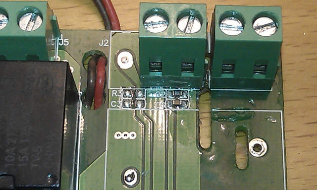
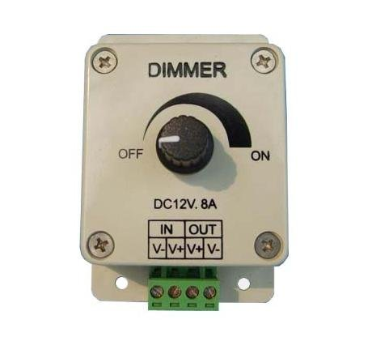

STC\-1000+ One vessel brew system controller
============================================

This is a firmware and Arduino based uploader for the STC-1000 dual stage thermostat. The purpose is to serve as a simple semi-automatic controller for a one vessel brewing system.

It is a fork off of [STC\-1000+](https://github.com/matsstaff/stc1000p/) visit that project for more information.

Download by visiting the [releases page](https://github.com/matsstaff/stc1000p-ovbsc/releases)

Features
--------

* Both Fahrenheit and Celsius versions
* Cheap, simple, semi automated one vessel brewing control
* Controls a pump and one or two heaters
* Alarm when user interaction is required
* Possible to delay heating of strike water
* User definable power output at different stages in the program
* Manual control
* 1-4 mash steps, 0-4 hop addition alarms
* Pause program at any time
* Button acceleration, for frustrationless programming by buttons

Parameters
----------

|Menu item|Description|Values|
|--------|-------|-------|
|Sd|Strike delay|0-999 minutes|
|St|Strike water setpoint|-40.0 to 140°C or -40.0 to 250°F|
|SO|Strike output (also used to reach hotbreak)|0-200%|
|Pt1|Mash step 1 setpoint|-40.0 to 140°C or -40.0 to 250°F|
|Pd1|Mash step 1 duration|0-999 minutes|
|Pt2|Mash step 2 setpoint|-40.0 to 140°C or -40.0 to 250°F|
|Pd2|Mash step 2 duration|0-999 minutes|
|Pt3|Mash step 3 setpoint|-40.0 to 140°C or -40.0 to 250°F|
|Pd3|Mash step 3 duration|0-999 minutes|
|Pt4|Mash step 4 setpoint|-40.0 to 140°C or -40.0 to 250°F|
|Pd4|Mash step 4 duration|0-999 minutes|
|PO|Mashing output|0-200%|
|Ht|Hot break temperature|-40.0 to 140°C or -40.0 to 250°F|
|HO|Hot break output|0-200%|
|Hd|Hot break duration|0-999 minutes|
|bO|Boil output|0-200%|
|bd|Boil duration|0-999 minutes|
|hd1|Hop alarm 1|0-999 minutes|
|hd2|Hop alarm 2|0-999 minutes|
|hd3|Hop alarm 3|0-999 minutes|
|hd4|Hop alarm 4|0-999 minutes|
|tc|Temperature correction|-5.0 to 5°C or -10.0 to 10.0°F|
|cO|Manual mode output|0-200%|
|cP|Manual mode pump|0 (=off) or 1 (=on)|
|cSP|Manual mode thermostat setpoint|-40.0 to 140°C or -40.0 to 250°F|
|ASd|Safety shutdown timer|0-999 minutes|
|rUn|Run mode|OFF, Pr (run program), Ct (manual mode thermostat), Co (manual mode constant output)|

Hardware usage
--------------

Pretty simple really. The two output relays can be used to control heaters. Either directly och replaced by solid state relays.
The output is specified in percent and is controlled with slow PWM (that is they are pulsed on/off). 0-100% controls heater 1 (heat relay), 100-200% controls heater 2 (cool relay). 
So for example, if an output of 75% is specified, heater 1 will be on 75% of the time and heater 2 will be off. At 125% heater 1 will be on and heater 2 will be on 25% of the time.

The output percentage is also used in thermostat mode, so if temperature is below setpoint, the output will be the specified one. If output is at or over the setpoint the output will be 0.

The unpopulated terminal on the STC can be used as pump control. The firmware will put this output in high impedance to turn pump on and pull it low to turn pump off.
 

This can be used directly with an 8A LED dimmer for flow control of a 12V pump.
 

The schematic of the dimmer shows, that if you connect this output to the center pin of the potentiometer, you can switch between off and the manual setting.
Note that you need to have a common ground for the STC and the dimmer.
 

Program algorithm
-----------------

* Wait *Sd* minutes (with all outputs off)
* Set output to *SO*, pump on, countdown = *ASd* minutes
* Wait until temp >= *St* (or end program if countdown = 0)
* Thermostat on with output *SO*
* St alarm, countdown = *ASd* minutes
* Wait until keypress (or end program if countdown = 0)
* pause (output off, pump off)
* (This is when you dough in and do manual vorlauf)
* Wait until power key is pressed
* *x* = 1
* *Init mashstep*: Thermostat off, set output to *SO*, pump on, countdown = *ASd* minutes
* Wait until temp >= *Ptx* (or end program if countdown = 0)
* Thermostat on with output *PO*, countdown = *Pdx*
* Wait until countdown = 0
* x = x+1
* if x<=4 goto *Init mashstep* 
* bU alarm, countdown = *ASd* minutes
* Wait until keypress (or end program if countdown = 0)
* pause (output off, pump off)
* (This is when you remove grains and sparge)
* Wait until power key is pressed
* Thermostat off, output = *SO*, pump off, countdown = *ASd* minutes
* Wait until temp >= *Ht* (or end program if countdown = 0)
* Output = *HO*, countdown = *Hd* minutes
* Wait until countdown = 0
* Output = *bO*, countdown = *bd* minutes
* Wait until countdown = 0, if countdown = *hdx* then hdx alarm
* Ch alarm, output = 0, pump off, end program

During the program, a single press on the power button will pause the program (during pause, a LED will flash and all outputs will be off). Press the power button again and the program will resume.

Updates
-------

|Date|Release|Description|
|----|-------|-----------|
|2015-XX-XX|v1.00|First release|

